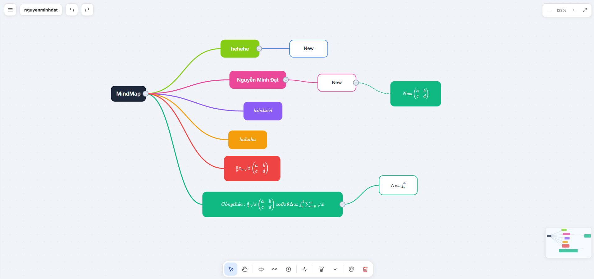

<div align="center">
  📧 Gmail: nguyenminhdat6401@gmail.com
  <br><br>
  <a href="https://nguyenminhdat6401.github.io/nmdat/">
    
  </a>
  <a href="https://www.linkedin.com/in/datnguyenminh6401/">
    
  </a>
</div>

# 🧠 Web Mind Map

Ứng dụng **Mind Map chạy trực tiếp trên trình duyệt** được xây dựng bằng **HTML, CSS, JavaScript (vanilla)**.
Cho phép tạo, chỉnh sửa và quản lý các node trực quan bằng SVG.

---

## 🚀 Demo

👉 https://github.com/nguyenminhdat6401/dmindmap-mathematicalformulas-demo

<p align="center">
  
</p>
---

## ✨ Tính năng

* 🟢 Tạo node bằng **double click**
* ✏️ Chỉnh sửa nội dung node bằng **double click vào node**
* 🔗 Hỗ trợ cấu trúc node & edge (có thể mở rộng)
* 🎨 Giao diện đơn giản, dễ dùng
* ⚡ Chạy hoàn toàn phía client (không cần backend)

---

## 🛠️ Công nghệ sử dụng

* HTML5
* CSS3
* JavaScript (Vanilla)
* SVG (render mindmap)

---

## 📁 Cấu trúc thư mục

```
mindmap/
│── index.html      # Giao diện chính
│── style.css       # Style tách riêng
│── app.js          # Logic xử lý
```

---

## ⚙️ Cách chạy project

### 1. Clone repo

```
git clone https://github.com/your-username/mindmap.git
```

### 2. Mở file

Chỉ cần mở `index.html` bằng trình duyệt:

```
double click index.html
```

---

## 📌 Cách sử dụng

* **Double click vào canvas** → tạo node mới
* **Double click vào node** → chỉnh sửa nội dung

---

## 🔥 Hướng phát triển (Future)

* [ ] Fix bug
* [ ] Lưu dữ liệu (localStorage / database)
* [ ] Export PNG / PDF

---

## 🤝 Đóng góp

Pull request luôn được chào đón.
Nếu bạn có ý tưởng hay, cứ mở issue 🚀

---

## 📄 License

MIT License © 2026

---
